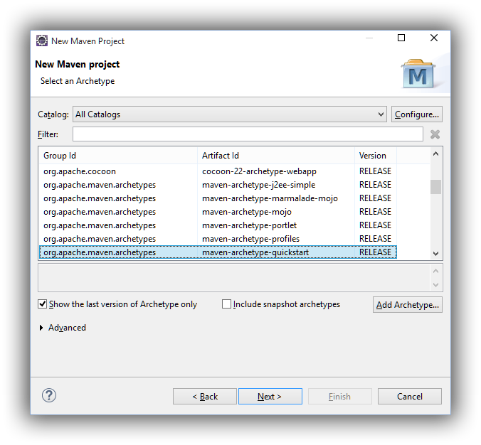

# JGrapht简单教程

### JGrapht是什么

> [JGraphT](http://jgrapht.org/) is a free Java graph library that provides mathematical graph-theory objects and algorithms. JGraphT supports various types of graphs including:

>	- **directed** and **undirected** graphs.
>	- graphs with **weighted** / **unweighted** / labeled or any user-defined edges.
>	- various edge multiplicity options, including: **simple-graphs**, **multigraphs**, **pseudographs**.
>	- **unmodifiable** graphs - allow modules to provide "read-only" access to internal graphs.
>	- **listenable** graphs - allow external listeners to track modification events.
>	- **subgraphs** graphs that are auto-updating subgraph views on other graphs.
>	- all compositions of above graphs.

>Although powerful, JGraphT is designed to be **simple** and **type-safe** (via Java generics). For example, graph vertices can be of any objects. You can create graphs based on: Strings, URLs, XML documents, etc; you can even create graphs of graphs! This [code example](https://raw.github.com/jgrapht/jgrapht/master/jgrapht-demo/src/main/java/org/jgrapht/demo/HelloJGraphT.java) shows how.

>Other features offered by JGraphT:

>	- graph visualization using the JGraph library ([try this demo](http://jgrapht.org/visualizations.html)!)
>	- complete source code included, under the terms of the GNU Lesser General Public >	- License and the EPL as well via dual licensing).
>	- comprehensive Javadocs.
>	- easy extensibility.

简单来说就是开源的Java图形（是Graph，不是Photo、Picture）处理库，可以构建有向/无向，带权重/不带全中的边，简单连通图/多个子图....的图，注意这个库负责图的构建、处理、提供各种算法（如[Prim's algorithm](http://en.wikipedia.org/wiki/Prim's_algorithm)、[Kruskal's algorithm](http://en.wikipedia.org/wiki/Kruskal%27s_algorithm)等，如下图所示），如果需要绘制、渲染，可结合JGraph、GraphStream等


### JGrapht包含的组件

主要是core(核心，一般用这个就可以了)和ext（一般是一些扩展）

http://mvnrepository.com/artifact/org.jgrapht/jgrapht-core/0.9.1

```xml
<dependency>
	<groupId>org.jgrapht</groupId>
	<artifactId>jgrapht-core</artifactId>
	<version>0.9.1</version>
</dependency>
```

http://mvnrepository.com/artifact/org.jgrapht/jgrapht-ext/0.9.1

```xml
<dependency>
	<groupId>org.jgrapht</groupId>
	<artifactId>jgrapht-ext</artifactId>
	<version>0.9.1</version>
</dependency>
```

还有自带了一些示例

```xml
<dependency>
	<groupId>org.jgrapht</groupId>
	<artifactId>jgrapht-demo</artifactId>
	<version>0.9.1</version>
</dependency>
```

### Maven

一般Java的工程都会用到很第三方依赖库，虽然可以手动下载回来配置，但如果需要用到的库很多，或者有复杂的依赖关系，如A依赖B/C（1.0版本），B依赖C（1.1版本）/D，自己处理容易出错，而且关联源代码非常麻烦，....。maven就是用来解决这些问题的，你只需要在自己工程的pom.xml里声明要什么库，他会帮你自动下载回来，安装配置好，非常实用。

Java的类库一般组织称groupId/artifactId/version的形式，即以分组的形式组织，如`jgrapht`放在`org.jgrapht`这个组里，包括`jgrapht-core`、`jgrapht-ext`、`jgrapht-demo`等子组件

### 使用Eclipse jee创建一个简单的基于maven的jgrapht工程

1. 下载最新版的eclipse-jee版本，需要安装有JDK（装JDK8u45）
	
2. 启动eclipse，创建maven工程

	File-New-Others

	

    选择maven模版，选择-archetype-quickstart即可

	

    选择自己工程的groupid，artifactid，例如你可以把自己的自学的教程例子都统一放在`com.xxx.tutorials`

	
3. 修改pom.xml，添加jgrapht的依赖项
	以下是我修改后的pom.xml文件内容
    ```xml
    <project xmlns="http://maven.apache.org/POM/4.0.0" xmlns:xsi="http://www.w3.org/2001/XMLSchema-instance"
	xsi:schemaLocation="http://maven.apache.org/POM/4.0.0 http://maven.apache.org/xsd/maven-4.0.0.xsd">
		<modelVersion>4.0.0</modelVersion>

		<groupId>com.liudonghua.tutorials</groupId>
		<artifactId>jgrapht</artifactId>
		<version>0.0.1-SNAPSHOT</version>
		<packaging>jar</packaging>

		<name>jgrapht</name>
		<url>http://maven.apache.org</url>

		<properties>
			<project.build.sourceEncoding>UTF-8</project.build.sourceEncoding>
		</properties>

		<dependencies>
			<dependency>
				<groupId>junit</groupId>
				<artifactId>junit</artifactId>
				<version>3.8.1</version>
				<scope>test</scope>
			</dependency>

			<dependency>
				<groupId>org.jgrapht</groupId>
				<artifactId>jgrapht-core</artifactId>
				<version>0.9.1</version>
			</dependency>
		</dependencies>
	</project>
    ```
4. 这里使用官方提供的[HelloJGraphT](https://raw.githubusercontent.com/jgrapht/jgrapht/master/jgrapht-demo/src/main/java/org/jgrapht/demo/HelloJGraphT.java)例子，可以快速浏览怎样使用JGrapht
    ```java
    /**
     * A simple introduction to using JGraphT.
     *
     * @author Barak Naveh
     * @since Jul 27, 2003
     */
    public final class HelloJGraphT {

        private HelloJGraphT() {
        }

        /**
         * The starting point for the demo.
         *
         * @param args
         *            ignored.
         */
        public static void main(String[] args) {
            UndirectedGraph<String, DefaultEdge> stringGraph = createStringGraph();

            // note undirected edges are printed as: {<v1>,<v2>}
            System.out.println(stringGraph.toString());

            // create a graph based on URL objects
            DirectedGraph<URL, DefaultEdge> hrefGraph = createHrefGraph();

            // note directed edges are printed as: (<v1>,<v2>)
            System.out.println(hrefGraph.toString());
        }

        /**
         * Creates a toy directed graph based on URL objects that represents link
         * structure.
         *
         * @return a graph based on URL objects.
         */
        private static DirectedGraph<URL, DefaultEdge> createHrefGraph() {
            DirectedGraph<URL, DefaultEdge> g = new DefaultDirectedGraph<URL, DefaultEdge>(
                    DefaultEdge.class);

            try {
                URL amazon = new URL("http://www.amazon.com");
                URL yahoo = new URL("http://www.yahoo.com");
                URL ebay = new URL("http://www.ebay.com");

                // add the vertices
                g.addVertex(amazon);
                g.addVertex(yahoo);
                g.addVertex(ebay);

                // add edges to create linking structure
                g.addEdge(yahoo, amazon);
                g.addEdge(yahoo, ebay);
            } catch (MalformedURLException e) {
                e.printStackTrace();
            }

            return g;
        }

        /**
         * Craete a toy graph based on String objects.
         *
         * @return a graph based on String objects.
         */
        private static UndirectedGraph<String, DefaultEdge> createStringGraph() {
            UndirectedGraph<String, DefaultEdge> g = new SimpleGraph<String, DefaultEdge>(
                    DefaultEdge.class);

            String v1 = "v1";
            String v2 = "v2";
            String v3 = "v3";
            String v4 = "v4";

            // add the vertices
            g.addVertex(v1);
            g.addVertex(v2);
            g.addVertex(v3);
            g.addVertex(v4);

            // add edges to create a circuit
            g.addEdge(v1, v2);
            g.addEdge(v2, v3);
            g.addEdge(v3, v4);
            g.addEdge(v4, v1);

            return g;
        }
    }
    ```
5. 好了，就先说这些，总之要根据的需求，看看文档或者是源码，或者添加jgrapht-demo的依赖库，然后看看官方提供的例子，如下图所示
	

### 最后提供一些网址
- jgrapht的maven仓库地址：[http://mvnrepository.com/artifact/org.jgrapht](http://mvnrepository.com/artifact/org.jgrapht)
- jgrapht的官网：[http://jgrapht.org/](http://jgrapht.org/)
- jgrapht的代码：[https://github.com/jgrapht/jgrapht](https://github.com/jgrapht/jgrapht)

